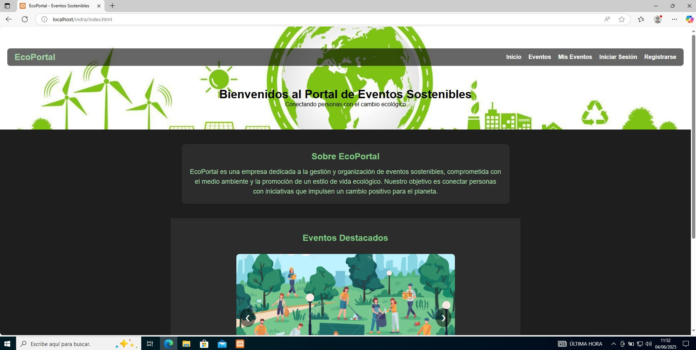
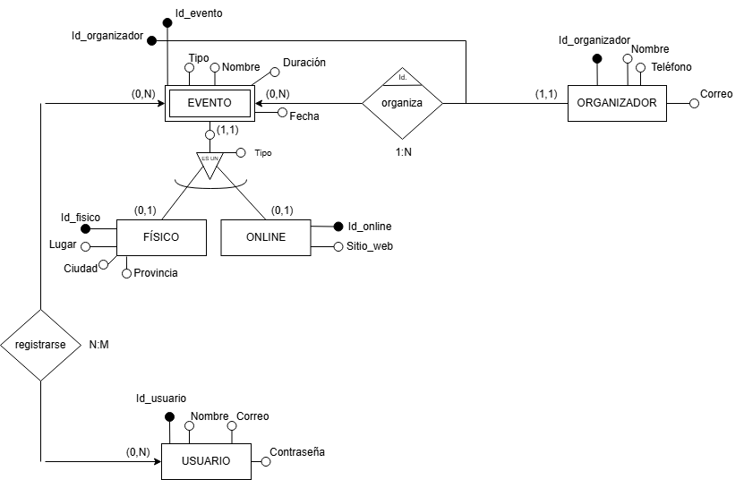

# Indra_Mihai
Este repositorio contiene todo el material relacionado con el desarrollo de una página web dedicada a eventos sostenibles.

En él se incluyen tanto la descripción del proyecto como evidencias visuales de la solución final (capturas de pantalla de la web y del grafo de ramas de Git).

Cada carpeta representa una parte específica del trabajo realizado para completar el proyecto de manera estructurada:

### [📁 /doc](./doc)
Contiene la [documentación](./doc/SO_y_XAMPP.pdf) sobre la instalación y configuración de Windows 10 en VirtualBox, así como la puesta en marcha de un servidor web local con XAMPP desde cero.

### [📁 /html](./html)
Incluye todos los archivos necesarios para la parte web: HTML, CSS, JavaScript y los recursos gráficos utilizados (imágenes de los eventos).

### [📁 /sql](./sql)
Se almacena el diagrama entidad-relación creado en draw.io, un documento PDF detallando el modelo y las tablas resultantes, junto con el script SQL para su creación en la base de datos.

### [📁 /src](./src)
Contiene el código fuente en Java, incluyendo la implementación de las clases que conforman el proyecto. También se incluyen dos clases de prueba realizadas y validadas con el software Autopilot.

